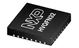
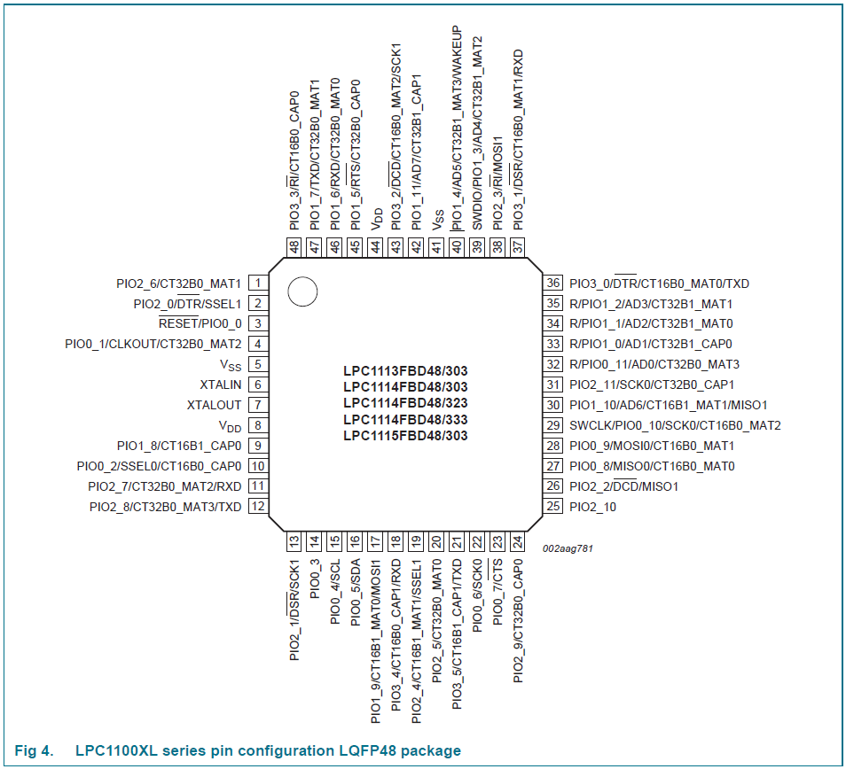

# [LPC1114](https://github.com/sochub/LPC1114) 
 
####  qitas@qitas.cn
#### 父级：[NXP](https://github.com/sochub/NXP)
#### 归属：[Cortex-M0](https://github.com/sochub/CM0) 

## [芯片简介](https://github.com/sochub/LPC1114/wiki)

LPC1114是NXP公司推出的一款ARM Cortex-M0 内核的32位单片机。它的主频最大可达50MHz，内部集成时钟产生单元，不用外部晶振也可以工作。

内部集成32KB FALSH程序存储器、8K SRAM数据存储器、一个快速I2C接口、一个RS485/EIA485 UART、两个带SSP特征的SPI接口、4个通用定时器、1个系统定时器、1个带窗口功能的看门狗定时器、功耗管理模块、1个ADC模块和42个GPIO。

 

特性：

* ARM Cortex-M0处理器，工作频率高达50 MHz
* 32 kB片内闪存编程存储器
* 28个通用I/O (GPIO)引脚
* 在8引脚中输入多路复用的10位ADC
* I²C总线接口，完全支持I²C总线规范和超快速模式
* 最大限度降低功耗的集成式PMU(电源管理单元)
* 3.3 V单电源(1.8 V至3.6 V)

 

### [资源组成](https://github.com/sochub/LPC1114)

* [参考文档](docs/)
* [参考资源](src/)
* [模板工程](demo/)

### [替换方案](https://github.com/sochub/LPC1114)

### [芯片应用](https://github.com/sochub/LPC1114)

* [OS-Q：485终端设备](https://github.com/OS-Q/D129)

##  [SoC资源平台](http://www.qitas.cn)
